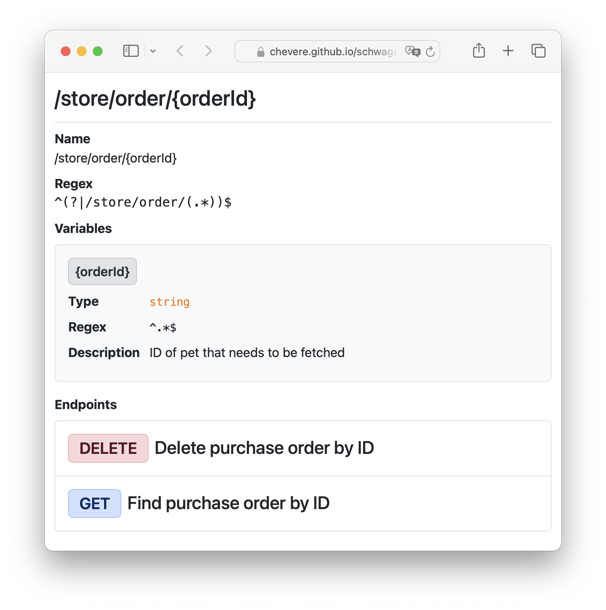
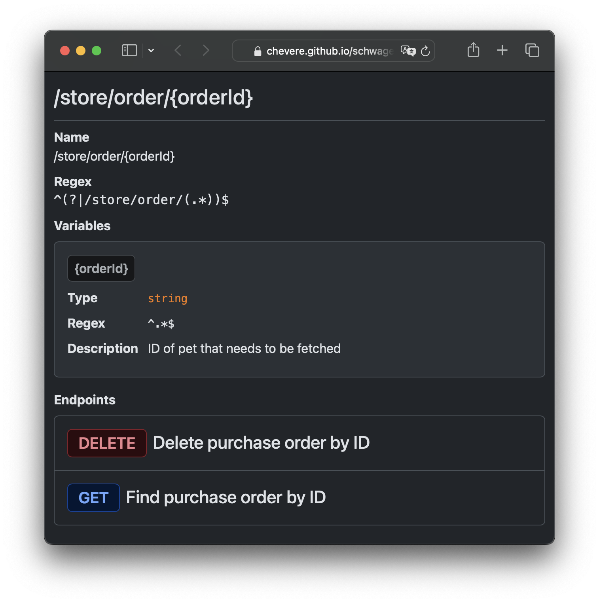

# Schwager HTML

> 🔔 Subscribe to the [newsletter](https://chv.to/chevere-newsletter) to don't miss any update regarding Chevere.


[](https://github.com/chevere/schwager-html/actions)

[](LICENSE)
[](https://phpstan.org/)
[](https://dashboard.stryker-mutator.io/reports/github.com/chevere/schwager-html/0.1)

[](https://sonarcloud.io/dashboard?id=chevere_schwager-html)
[](https://sonarcloud.io/dashboard?id=chevere_schwager-html)
[](https://sonarcloud.io/dashboard?id=chevere_schwager-html)
[](https://sonarcloud.io/dashboard?id=chevere_schwager-html)
[](https://sonarcloud.io/dashboard?id=chevere_schwager-html)
[](https://sonarcloud.io/dashboard?id=chevere_schwager-html)
[](https://www.codefactor.io/repository/github/chevere/schwager-html)
[](https://app.codacy.com/gh/chevere/schwager-html/dashboard)

## Demo




There's an [online demo](https://chevere.github.io/schwager-html/demo/output/schwager.html) you can checkout. This is generated from the script at [demo/demo.php](demo/demo.php)

## Quick start

* Install using [Composer](https://packagist.org/packages/chevere/schwager-html)

```php
composer require chevere/schwager-html
```

* Generate HTML

```php
use Chevere\Schwager\DocumentSchema;
use Chevere\Schwager\ServerSchema;
use Chevere\Schwager\Spec;
use Chevere\SchwagerHTML\Html;
use function Chevere\Router\router;

// Load your router
$routes = require 'routes.php';
$router = router($routes);
// Create document
$document = new DocumentSchema(
    api: 'schwager',
    name: '🐶 Schwager Petstore',
    version: '1.0.0'
);
// Create server
$testServer = new ServerSchema(
    url: 'demoServerUrl',
    description: 'This is a sample server Petstore API spec.'
);
// Create spec
$spec = new Spec($router, $document, $testServer);
// Create html
$html = new Html($spec);
// Read html as string
$html->__toString();
```

## Documentation

Documentation is available at [chevere.org](https://chevere.org/packages/schwager.html).

## License

Copyright 2023 [Rodolfo Berrios A.](https://rodolfoberrios.com/)

Chevere is licensed under the Apache License, Version 2.0. See [LICENSE](LICENSE) for the full license text.

Unless required by applicable law or agreed to in writing, software distributed under the License is distributed on an "AS IS" BASIS, WITHOUT WARRANTIES OR CONDITIONS OF ANY KIND, either express or implied. See the License for the specific language governing permissions and limitations under the License.
